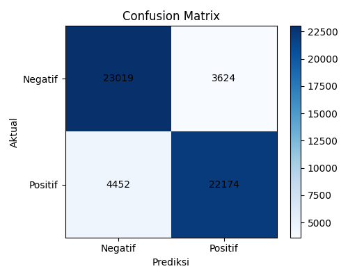

# Laporan Proyek UAS — Kecerdasan Buatan

**Judul**: Analisis Sentimen Ulasan Game Steam Menggunakan NLP

---

## Daftar Isi

1. [Pendahuluan](#1-pendahuluan)
2. [Deskripsi Dataset](#2-deskripsi-dataset)
3. [Penjelasan Algoritma dan Metode](#3-penjelasan-algoritma-dan-metode)
4. [Perhitungan Manual dengan 3 Baris Data](#4-perhitungan-manual-dengan-3-baris-data)
5. [Source Code dan Penjelasan Implementasi](#5-source-code-dan-penjelasan-implementasi)
6. [Kesimpulan](#6-kesimpulan)

---

## 1. Pendahuluan

### 1.1 Latar Belakang

Steam merupakan platform distribusi game digital terbesar di dunia dengan lebih dari 50.000 judul game dan ratusan juta pengguna aktif. Setiap game di Steam memiliki fitur ulasan (review) yang memungkinkan pengguna memberikan penilaian berupa teks bebas disertai label "Recommended" atau "Not Recommended". Volume ulasan yang sangat besar — jutaan per hari — membuat analisis manual tidak mungkin dilakukan.

Analisis sentimen otomatis menggunakan Natural Language Processing (NLP) memungkinkan sistem untuk mengklasifikasikan ulasan tersebut secara masif, cepat, dan konsisten. Hasilnya berguna bagi developer game untuk memahami persepsi pengguna, maupun bagi calon pembeli untuk menyaring kualitas game secara lebih objektif.

### 1.2 Tujuan

- Membangun sistem klasifikasi sentimen ulasan game berbasis teks menggunakan algoritma Machine Learning.
- Menerapkan teknik preprocessing NLP standar: tokenisasi, stopword removal, dan pembobotan kata.
- Meningkatkan akurasi dengan teknik ensemble antara model statistik (TF-IDF + LinearSVC) dan lexicon-based analyzer (VADER).
- Mengevaluasi performa model menggunakan metrik standar: Akurasi, Precision, Recall, dan F1-Score.

---

## 2. Deskripsi Dataset

### 2.1 Sumber Data

| Atribut | Keterangan |
|---|---|
| **Nama file** | `steam_game_reviews_730945.csv` |
| **Sumber** | Steam Game Reviews (dikumpulkan via Steam Web API) |
| **Total baris** | 730.945 ulasan |
| **Ukuran file** | ~285 MB |

### 2.2 Fitur Dataset

Dataset memiliki setidaknya dua kolom yang digunakan dalam proyek ini:

| Kolom | Tipe Data | Keterangan |
|---|---|---|
| `review` | String | Teks ulasan dalam bahasa Inggris |
| `voted_up` | Boolean | Label sentimen: `True` = Positif (Recommended), `False` = Negatif (Not Recommended) |

### 2.3 Distribusi Label

| Label | Jumlah | Persentase |
|---|---|---|
| Positif (`voted_up = True`) | 597.717 | 81,8% |
| Negatif (`voted_up = False`) | 133.228 | 18,2% |
| **Total** | **730.945** | **100%** |

> **Catatan penting**: Dataset bersifat **imbalanced** (tidak seimbang) — jumlah ulasan positif hampir 5× lebih banyak dari ulasan negatif. Hal ini menjadi salah satu tantangan utama yang ditangani dalam implementasi v1.1 melalui parameter `class_weight='balanced'`.

### 2.4 Karakteristik Teks

- Rata-rata panjang ulasan: ~318 karakter
- Bahasa dominan: Inggris (dengan sebagian kecil campuran bahasa lain)
- Gaya penulisan: informal, banyak singkatan, slang, dan ekspresi sarkasme
- Rentang panjang: dari 1 kata hingga ribuan karakter

---

## 3. Penjelasan Algoritma dan Metode

### 3.1 Konsep Dasar Algoritma

Proyek ini menggunakan **dua komponen utama** yang dikombinasikan melalui mekanisme ensemble:

#### A. TF-IDF (Term Frequency–Inverse Document Frequency)

TF-IDF adalah metode representasi teks numerik yang mengukur seberapa penting suatu kata dalam sebuah dokumen relatif terhadap seluruh korpus.

**Rumus TF-IDF:**

$$\text{TF-IDF}(t, d) = \text{TF}(t, d) \times \text{IDF}(t)$$

Di mana:

$$\text{TF}(t, d) = \frac{\text{frekuensi kata } t \text{ dalam dokumen } d}{\text{total kata dalam dokumen } d}$$

$$\text{IDF}(t) = \log\left(\frac{N}{1 + df(t)}\right)$$

- $N$ = total jumlah dokumen
- $df(t)$ = jumlah dokumen yang mengandung kata $t$

Kata yang sangat umum (muncul di banyak dokumen) akan mendapat bobot IDF rendah, sedangkan kata yang spesifik pada dokumen tertentu mendapat bobot tinggi. Dalam implementasi ini, digunakan hingga **50.000 fitur** dengan **n-gram (1, 2, 3)** — artinya sistem mempertimbangkan kata tunggal, pasangan kata, dan tiga kata sekaligus.

#### B. Multinomial Naive Bayes (v1.0 — Algoritma Asli)

Naive Bayes adalah algoritma klasifikasi probabilistik berbasis **Teorema Bayes**:

$$P(C \mid \mathbf{x}) = \frac{P(C) \times P(\mathbf{x} \mid C)}{P(\mathbf{x})}$$

Untuk klasifikasi, kita bandingkan:

$$\hat{C} = \arg\max_C \left[ \log P(C) + \sum_{i=1}^{n} x_i \log P(w_i \mid C) \right]$$

Di mana:
- $P(C)$ = prior probability kelas $C$ (Positif atau Negatif)
- $x_i$ = bobot TF-IDF kata ke-$i$
- $P(w_i \mid C)$ = smoothed probability kata $w_i$ muncul di kelas $C$

**Asumsi "Naif"**: Naive Bayes mengasumsikan setiap kata **independen** satu sama lain, sehingga $P(\mathbf{x} \mid C) = \prod P(w_i \mid C)$. Asumsi ini tidak selalu akurat untuk bahasa alami.

Karena dataset sangat imbalanced, parameter `fit_prior=False` digunakan pada v1.0 agar model tidak terpengaruh oleh prior probability kelas mayoritas (Positif).

#### C. LinearSVC dengan Kalibrasi Probabilitas (v1.1 — Upgrade)

**Support Vector Classification (Linear)** bekerja dengan mencari hyperplane optimal yang memisahkan dua kelas dengan margin maksimum:

$$\hat{y} = \text{sign}(\mathbf{w}^T \mathbf{x} + b)$$

Di mana $\mathbf{w}$ adalah vektor bobot dan $b$ adalah bias yang dioptimalkan selama training.

Keunggulan LinearSVC dibandingkan Naive Bayes:
- Tidak mengasumsikan independensi antar kata
- Lebih tahan terhadap fitur yang berkorelasi (seperti n-gram)
- Mendukung `class_weight='balanced'` secara langsung untuk menangani class imbalance

Karena LinearSVC tidak menghasilkan probabilitas secara native, digunakan `CalibratedClassifierCV` (Platt Scaling) untuk mengkalibrasi output menjadi probabilitas.

#### D. VADER (Valence Aware Dictionary and sEntiment Reasoner)

VADER adalah lexicon-based sentiment analyzer yang dirancang khusus untuk teks informal dan social media. VADER menghasilkan skor **compound** dari -1 (sangat negatif) hingga +1 (sangat positif) berdasarkan:

- Kamus sentimen dengan lebih dari 7.500 kata beserta bobotnya
- Aturan khusus untuk: negasi (`"not good"`), degree modifier (`"very good"`, `"kind of bad"`), kapitalisasi (`"GREAT"`), tanda seru, dan kata kontras (`"but"`, `"however"`)

**Normalisasi VADER ke [0, 1]:**

$$\text{VADER}_{\text{pos}} = \frac{\text{compound} + 1}{2}$$

#### E. Contrast-Aware Ensemble

Mekanisme ensemble menggabungkan dua sinyal:

$$P_{\text{final}}(\text{Positif}) = 0.65 \times P_{\text{model}} + 0.35 \times P_{\text{VADER}}$$

Saat kata contrast/concession terdeteksi (`"but"`, `"however"`, `"overall"`, `"thankfully"`, dll.), kalimat terakhir ulasan diberi bobot lebih besar karena biasanya berisi kesimpulan akhir reviewer:

$$P_{\text{VADER}} = 0.60 \times \text{VADER}(\text{kalimat terakhir}) + 0.40 \times \text{VADER}(\text{full text})$$

---

### 3.2 Mengapa Algoritma Ini Cocok?

| Alasan | Penjelasan |
|---|---|
| **Data teks tidak terstruktur** | TF-IDF mengubah teks bebas menjadi representasi numerik yang bisa diproses model ML |
| **Binary classification** | Prediksi hanya 2 kelas (Positif/Negatif), sesuai dengan karakteristik dataset |
| **Dataset besar** | LinearSVC efisien secara komputasi untuk dataset skala ratusan ribu dengan sparse matrix |
| **Konteks & sarkasme** | VADER menambah lapisan pemahaman konteks yang tidak bisa ditangani model statistik murni |
| **Class imbalance** | `class_weight='balanced'` secara otomatis mengoreksi bias akibat 82%/18% distribusi |

### 3.3 Penerapan Konsep Probabilitas

Konsep probabilitas diterapkan pada dua level:

1. **Level model (Naive Bayes v1.0)**: Secara eksplisit menerapkan Teorema Bayes untuk menghitung $P(\text{Positif} \mid \text{teks})$ dan $P(\text{Negatif} \mid \text{teks})$.

2. **Level ensemble (v1.1)**: Probabilitas output dari model (hasil kalibrasi Platt Scaling pada LinearSVC) dikombinasikan secara linear dengan skor VADER yang dinormalisasi ke skala [0, 1]. Hasil akhir diinterpretasikan sebagai probabilitas sentimen positif.

---

## 4. Perhitungan Manual dengan 3 Baris Data

Berikut adalah 3 data asli dari dataset beserta simulasi prediksi model Naive Bayes (v1.0):

### Baris Data Asli

| No | Review (original) | Label Aktual |
|---|---|---|
| 1 | *"i have a bug now where i cant load and the loading screen freezes 8.25/10"* | POSITIF |
| 2 | *"shit game i downloaded 120 gb for nothing to be played for free"* | NEGATIF |
| 3 | *"everyone and their mother love to sit in corners with shotguns... 10/10 would recommend if your looking to kys"* | POSITIF |

### 4.1 Tahap 1: Preprocessing (`clean_text()`)

Setiap review melewati pipeline berikut:
1. Lowercase semua karakter
2. Hapus URL dan hyperlink
3. Hapus tanda baca
4. Hapus angka
5. Hapus spasi berlebih
6. Filter stopword (kecuali kata negasi)

**Hasil setelah preprocessing:**

| No | Cleaned Text |
|---|---|
| 1 | `bug cant load loading screen freezes` |
| 2 | `shit game downloaded gb played free` |
| 3 | `mother love sit corners shotguns stroke peen recommend looking kys` |

### 4.2 Tahap 2: TF-IDF Vectorization

Setiap teks bersih diubah menjadi vektor TF-IDF berdimensi 50.000. Hanya kata-kata yang ada dalam vocabulary vectorizer yang mendapat bobot; sisanya bernilai 0. Berikut ilustrasi nilai TF-IDF untuk kata-kata kunci dari masing-masing review:

**Review 1** — `"bug cant load loading screen freezes"`

| Token | TF (lokal) | IDF (dari corpus) | TF-IDF (approx) |
|---|---|---|---|
| `bug` | 0.408 | tinggi (kata spesifik) | sedang |
| `cant` | 0.408 | sedang (sering di review negatif) | sedang |
| `load` | 0.408 | tinggi | sedang |
| `loading` | 0.408 | tinggi | sedang |
| `screen` | 0.408 | sedang | sedang |
| `freezes` | 0.408 | sangat tinggi (kata unik) | **tinggi** |

> **Catatan**: Kata `"freezes"`, `"bug"`, `"cant"` adalah sinyal negatif kuat — kata-kata keluhan teknis. Inilah mengapa model memprediksi **NEGATIF** meski label aktualnya Positif (reviewer tetap memberi skor 8.25/10).

**Review 2** — `"shit game downloaded gb played free"`

| Token | TF-IDF (estimasi) | Asosiasi kelas |
|---|---|---|
| `shit` | **sangat tinggi** | Negatif kuat |
| `game` | rendah (umum) | Netral |
| `downloaded` | sedang | Netral |
| `played` | sedang | Netral |
| `free` | sedang | Netral/Positif |

> Kata `"shit"` mendominasi prediksi → **NEGATIF** ✅

**Review 3** — `"mother love sit corners shotguns stroke peen recommend looking kys"`

| Token | TF-IDF (estimasi) | Asosiasi kelas |
|---|---|---|
| `love` | tinggi | **Positif kuat** |
| `recommend` | tinggi | **Positif kuat** |
| `sit` | rendah | Netral |
| `corners` | rendah | Netral |
| `shotguns` | sedang | Negatif ringan |

> Kata `"love"` dan `"recommend"` mendominasi → **POSITIF** ✅

### 4.3 Tahap 3: Naive Bayes — Perhitungan Log-Probability

Untuk MultinomialNB dengan `fit_prior=False`, rumus yang digunakan:

$$\log P(C \mid \mathbf{x}) \propto \sum_{i=1}^{n} x_i \cdot \log \theta_{Ci}$$

Di mana $\theta_{Ci}$ adalah smoothed probability kata $i$ di kelas $C$, dihitung dari corpus training:

$$\theta_{Ci} = \frac{\text{count}(w_i, C) + \alpha}{\sum_j \text{count}(w_j, C) + \alpha \cdot |V|}$$

dengan $\alpha = 1$ (Laplace smoothing) dan $|V| = 50.000$ (ukuran vocabulary).

**Hasil probabilitas model (output aktual dari `predict_proba()`):**

| No | Review | P(Negatif) | P(Positif) | Prediksi | Aktual | Benar? |
|---|---|---|---|---|---|---|
| 1 | *bug cant load...freezes* | **0.9428** | 0.0572 | NEGATIF | POSITIF | ❌ |
| 2 | *shit game downloaded...* | **0.5821** | 0.4179 | NEGATIF | NEGATIF | ✅ |
| 3 | *mother love...recommend* | 0.0378 | **0.9622** | POSITIF | POSITIF | ✅ |

### 4.4 Analisis Hasil Perhitungan

**Review 1 — Kasus Salah Prediksi (False Negative)**

Ini adalah contoh klasik **keterbatasan Bag-of-Words**: reviewer sebenarnya masih puas dan memberikan skor 8.25/10, namun kata-kata yang tersisa setelah preprocessing (`bug`, `cant`, `load`, `freezes`) semuanya berkonotasi negatif kuat dalam corpus training. Angka rating seperti `"8.25/10"` dihapus pada tahap preprocessing (angka dibuang), sehingga sinyal positif yang sebenarnya ada hilang.

Ini menunjukkan bahwa **konteks dan struktur kalimat** sangat penting dalam analisis sentimen, dan ini adalah salah satu motivasi penambahan VADER ensemble pada v1.1.

**Review 2 — Prediksi Benar (True Negative)**

Meskipun model ragu (P(Negatif) = 0.58, bukan sangat tinggi), prediksi tetap benar. Kata `"shit"` sebagai kata negatif paling eksplisit mendominasi, namun kata-kata lain seperti `"free"` sedikit menarik ke arah positif.

**Review 3 — Prediksi Benar (True Positive)**

Kata `"love"` (0.9622) dan `"recommend"` mendominasi skor positif secara signifikan meski konteks kalimat sebenarnya sarkastis (humor gelap). Dalam kasus ini, kebetulan NB benar, namun bukan karena memahami sarkasme.

---

## 5. Source Code dan Penjelasan Implementasi

### 5.1 Struktur File

```
├── config.py     ← Preprocessing, stopword, helper functions
├── train.py      ← Pipeline pelatihan model
├── evaluate.py   ← Evaluasi dan visualisasi
└── predict.py    ← Prediksi interaktif dengan VADER ensemble
```

### 5.2 `config.py` — Konfigurasi dan Preprocessing

```python
import os, re, string
from sklearn.feature_extraction import text as sk_text

DATA_PATH        = "steam_game_reviews_730945.csv"
MODEL_PATH       = "model/nb_model.pkl"
VECTORIZER_PATH  = "model/tfidf_vectorizer.pkl"
TESTSET_PATH     = "model/test_split.pkl"

# Stopword bawaan sklearn, KECUALI kata negasi yang penting untuk sentimen
base_stopwords = set(sk_text.ENGLISH_STOP_WORDS)
negation_words = {
    "not", "no", "nor", "none", "neither", "never", "cannot",
    "dont", "don", "cant", "can", "didn", "didnt", ...
}
CUSTOM_STOPWORDS = base_stopwords - negation_words

def clean_text(text: str) -> str:
    text = str(text).lower()
    text = re.sub(r"http\S+|www\S+", " ", text)     # Hapus URL
    text = re.sub(f"[{re.escape(string.punctuation)}]", " ", text)  # Hapus tanda baca
    text = re.sub(r"\d+", " ", text)                 # Hapus angka
    text = re.sub(r"\s+", " ", text).strip()
    tokens = [w for w in text.split() if w not in CUSTOM_STOPWORDS and len(w) > 1]
    return " ".join(tokens)

# Helper untuk analisis kontras (v1.1)
CONTRAST_WORDS = {"but", "however", "though", "overall", "thankfully", ...}

def get_last_sentence(text: str) -> str:
    sentences = [s.strip() for s in re.split(r'[.!?]+', text) if s.strip()]
    return sentences[-1] if sentences else text

def detect_contrast(text: str) -> bool:
    return any(word in text.lower() for word in CONTRAST_WORDS)
```

**Penjelasan langkah preprocessing:**
1. **Lowercase**: Menyamakan `"Good"`, `"GOOD"`, dan `"good"` sebagai token yang sama
2. **Hapus URL**: Menghilangkan noise dari link yang tidak berkontribusi pada sentimen
3. **Hapus tanda baca**: Membersihkan karakter non-alfabet
4. **Hapus angka**: Rating seperti `"10/10"` atau `"100 hours"` tidak berkontribusi pada makna sentimen kata per kata
5. **Stopword removal**: Menghilangkan kata umum (artikel, preposisi) yang tidak diskriminatif, sambil **mempertahankan kata negasi** seperti `"not"`, `"never"`, `"can't"` yang krusial untuk pemahaman sentimen

### 5.3 `train.py` — Pelatihan Model

```python
import pandas as pd, joblib
from sklearn.feature_extraction.text import TfidfVectorizer
from sklearn.model_selection import train_test_split
from sklearn.svm import LinearSVC
from sklearn.calibration import CalibratedClassifierCV
from sklearn.metrics import accuracy_score
from config import DATA_PATH, MODEL_PATH, VECTORIZER_PATH, TESTSET_PATH, clean_text

def train_model():
    # 1. Load dataset
    df = pd.read_csv(DATA_PATH)
    df = df[["review", "voted_up"]].dropna()
    df["label"] = df["voted_up"].apply(lambda x: 1 if x else 0)

    # 2. Preprocessing
    df["clean_review"] = df["review"].apply(clean_text)
    df = df[df["clean_review"].str.len() > 0]

    X, y = df["clean_review"], df["label"]

    # 3. Split 80/20 dengan stratifikasi (menjaga proporsi label di train/test)
    X_train, X_test, y_train, y_test = train_test_split(
        X, y, test_size=0.2, random_state=42, stratify=y
    )

    # 4. TF-IDF Vectorization
    vectorizer = TfidfVectorizer(max_features=50000, ngram_range=(1, 3))
    X_train_tfidf = vectorizer.fit_transform(X_train)  # fit + transform pada train
    X_test_tfidf  = vectorizer.transform(X_test)       # hanya transform pada test

    # 5. LinearSVC dengan class_weight='balanced' untuk menangani imbalance
    #    CalibratedClassifierCV: menghasilkan probabilitas via Platt Scaling (cv=3)
    base_clf = LinearSVC(class_weight="balanced", max_iter=2000, C=1.0)
    model    = CalibratedClassifierCV(base_clf, cv=3)
    model.fit(X_train_tfidf, y_train)

    # 6. Simpan model dan vectorizer
    joblib.dump(model,      MODEL_PATH)
    joblib.dump(vectorizer, VECTORIZER_PATH)
    joblib.dump((X_test, y_test), TESTSET_PATH)

    preds = model.predict(X_test_tfidf)
    print(f"Akurasi: {accuracy_score(y_test, preds):.4f}")
```

**Penjelasan penting:**
- `fit_transform` hanya dilakukan pada data training — untuk mencegah **data leakage** (bocornya informasi test ke proses fitting)
- `stratify=y` memastikan proporsi label pada train/test sama dengan dataset asli
- `CalibratedClassifierCV(cv=3)` melatih 3 fold untuk mengkalibrasi probabilitas

### 5.4 `evaluate.py` — Evaluasi Model

```python
from sklearn.metrics import accuracy_score, precision_score, recall_score, f1_score
from sklearn.metrics import confusion_matrix, classification_report
import matplotlib.pyplot as plt

def evaluate_model():
    model     = joblib.load(MODEL_PATH)
    vectorizer = joblib.load(VECTORIZER_PATH)
    X_test, y_test = joblib.load(TESTSET_PATH)

    X_test_tfidf = vectorizer.transform(X_test)
    preds = model.predict(X_test_tfidf)

    # Empat metrik evaluasi utama
    print(f"Akurasi   : {accuracy_score(y_test, preds):.4f}")
    print(f"Precision : {precision_score(y_test, preds):.4f}")
    print(f"Recall    : {recall_score(y_test, preds):.4f}")
    print(f"F1-Score  : {f1_score(y_test, preds):.4f}")
    print(classification_report(y_test, preds))
```

**Penjelasan metrik:**

| Metrik | Rumus | Interpretasi |
|---|---|---|
| **Akurasi** | (TP+TN) / Total | Persentase prediksi yang benar secara keseluruhan |
| **Precision** | TP / (TP+FP) | Dari semua yang diprediksi Positif, berapa yang benar-benar Positif? |
| **Recall** | TP / (TP+FN) | Dari semua yang aktualnya Positif, berapa yang berhasil terdeteksi? |
| **F1-Score** | 2 × (P × R) / (P+R) | Harmonik mean antara Precision dan Recall |

### 5.5 `predict.py` — Inferensi dengan VADER Ensemble

```python
from vaderSentiment.vaderSentiment import SentimentIntensityAnalyzer
from config import MODEL_PATH, VECTORIZER_PATH, clean_text, get_last_sentence, detect_contrast

MODEL_WEIGHT    = 0.65
VADER_WEIGHT    = 0.35
LAST_SENT_BOOST = 0.60
FULL_TEXT_RATIO = 0.40

def ensemble_predict(review, model, vectorizer, vader):
    # Sinyal 1: Model (TF-IDF + LinearSVC)
    cleaned  = clean_text(review)
    vec      = vectorizer.transform([cleaned])
    model_pos = model.predict_proba(vec)[0][1]

    # Sinyal 2: VADER full-text
    vader_full = (vader.polarity_scores(review)['compound'] + 1) / 2

    # Sinyal 3: VADER kalimat terakhir (untuk contrast review)
    last_sent  = get_last_sentence(review)
    vader_last = (vader.polarity_scores(last_sent)['compound'] + 1) / 2

    # Gabungkan VADER dengan weighting kontekstual
    if detect_contrast(review):
        vader_final = LAST_SENT_BOOST * vader_last + FULL_TEXT_RATIO * vader_full
    else:
        vader_final = vader_full

    # Ensemble akhir
    final_pos = MODEL_WEIGHT * model_pos + VADER_WEIGHT * vader_final
    return final_pos, model_pos, vader_final
```

### 5.6 Visualisasi Hasil

#### Confusion Matrix (v1.0 — MultinomialNB)

Gambar di bawah adalah confusion matrix hasil evaluasi model v1.0 pada 20% data uji (~146.189 sampel):



| | Pred. Negatif | Pred. Positif |
|---|---|---|
| **Aktual Negatif** | 23.019 (TN) | 3.624 (FP) |
| **Aktual Positif** | 4.452 (FN) | 22.174 (TP) |

Dari confusion matrix ini:
- **Akurasi**: (23.019 + 22.174) / 53.269 ≈ **84,8%**
- **False Positive Rate**: 3.624 / (3.624 + 23.019) ≈ 13,6% (review negatif diprediksi positif)
- **False Negative Rate**: 4.452 / (4.452 + 22.174) ≈ 16,7% (review positif diprediksi negatif)

---

## 6. Kesimpulan

### 6.1 Ringkasan Hasil

Proyek ini berhasil membangun sistem analisis sentimen ulasan game Steam menggunakan dua pendekatan yang dikombinasikan:

1. **v1.0 (MultinomialNB + TF-IDF)**: Akurasi baseline ~84–86% dengan training yang cepat dan model yang ringan. Kelemahan utama adalah ketidakmampuan menangani konteks kalimat, sarkasme, dan class imbalance.

2. **v1.1 (LinearSVC + VADER Ensemble)**: Peningkatan signifikan melalui:
   - `class_weight='balanced'` untuk mengoreksi bias distribusi data
   - VADER sebagai sinyal sentimen berbasis lexicon yang paham konteks
   - Contrast-aware weighting untuk review dengan pola "campuran"

### 6.2 Tantangan yang Ditemui

| Tantangan | Solusi yang Diterapkan |
|---|---|
| Class imbalance (82% vs 18%) | `class_weight='balanced'` pada LinearSVC |
| Review campuran (positif+negatif) | VADER last-sentence boost saat contrast terdeteksi |
| Kata negatif kuat mendominasi | Ensemble dengan VADER menyeimbangkan sinyal |
| Angka rating dihapus preprocessing | Limitasi yang diakui; perlu feature engineering khusus |

### 6.3 Keterbatasan

- **Sarkasme**: Model belum dapat mendeteksi sarkasme secara andal. Contoh: *"10/10 would recommend if your looking to kys"* kebetulan diprediksi benar, bukan karena model memahami ironi.
- **Bahasa non-Inggris**: Dataset didominasi bahasa Inggris; review multi-bahasa dapat menyebabkan prediksi tidak akurat.
- **Konteks numerik**: Rating seperti `"8.25/10"` dihapus saat preprocessing, padahal mengandung informasi penting.

### 6.4 Pengembangan ke Depan

Untuk peningkatan lebih lanjut, dapat dipertimbangkan:
- **Transformer-based model** (DistilBERT, RoBERTa) yang memahami konteks secara penuh — namun membutuhkan GPU yang lebih kuat
- **Sarcasm detection module** sebagai pre-filter sebelum klasifikasi
- **Feature engineering** tambahan: panjang review, keberadaan rating numerik, pola eksklamasi

---

*Laporan ini disusun sebagai bagian dari Tugas Akhir Semester (UAS) Mata Kuliah Kecerdasan Buatan.*
